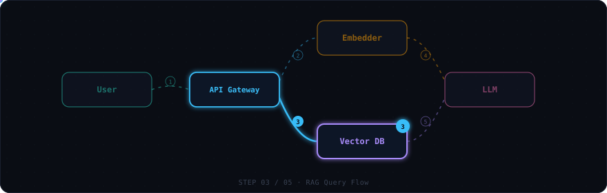

<p align="center">
  
</p>

<h1 align="center">Interactive Architecture Diagrams</h1>

<p align="center">
  <a href="https://www.mintlify.com/blog/skill-md"><b>Agent Skill</b></a> for Claude Code · Gemini CLI · GitHub Copilot CLI · OpenCode · Cursor<br/>
  Build click-through, animated system architecture diagrams as a single HTML file.<br/>
  No build step. No dependencies. One file you can email, host, or open locally.
</p>

<p align="center">
  <a href="#install"><b>Install</b></a> ·
  <a href="#try-it"><b>Try It</b></a> ·
  <a href="#example-prompts"><b>Examples</b></a> ·
  <a href="skills/architecture-diagram/SKILL.md"><b>Skill Spec</b></a>
</p>

> Build click-through, animated system architecture diagrams as a single HTML file. Drop it into a workshop, design review, or onboarding doc and let people **watch the data flow** instead of reading static boxes-and-arrows.

This is an [Agent Skill](https://www.mintlify.com/blog/skill-md) — a folder of instructions any compatible AI coding agent loads on demand. When you ask for an architecture diagram, this skill takes over and produces a self-contained `architecture.html` plus a companion `architecture.md` description. Works with Claude Code, Gemini CLI, GitHub Copilot CLI, OpenCode, Cursor, and any tool supporting the SKILL.md standard.

---

## What you get

Each generated diagram includes:

- **Named flows** — pick a scenario tab (`RAG Query`, `Login`, `Ingest`, …) and watch it play out step by step
- **Animated data packets** glowing along quadratic-curve wires between services
- **Side panel** showing the current step's payload, description, and metadata chips (latency, auth headers, ports)
- **Mode toggles** — switch between `offline/online`, `dev/prod`, or `v1/v2` to swap node labels, ports, and payloads in place
- **Drag-and-drop nodes** — reposition any tile by dragging; snaps to grid, wires redraw live, layout saved to localStorage
- **Player controls** — play/pause/step, keyboard shortcuts, visual progress bar
- **Dark/light theme toggle** — switch with one click or press `T` (preference saved in localStorage)
- **Fullscreen mode** — press `F` to expand the canvas for presentations; `Escape` to exit

No build step. No dependencies. One HTML file you can email, host, or open locally.

Battle-tested on a public RAG workshop (Eskadra Bielik) and several internal design reviews.

---

## When to use this skill

| Situation | Use this? |
|---|---|
| "Show me how the auth flow works" (interactive, for a workshop) | **Yes** |
| "Design the RAG pipeline before we build it" (planning a new service) | **Yes** |
| "Build an architecture mockup we can iterate on with the team" | **Yes** |
| "Visualize our microservices and how they communicate" | **Yes** |
| "Map out the CI/CD pipeline for onboarding docs" | **Yes** |
| "Show the data flow through our ETL pipeline" | **Yes** |
| "Draw a sequence diagram for this PR" (static, lives in markdown) | No — a Mermaid sequence diagram inline is simpler |
| "I just need a static boxes-and-arrows topology" (no flows/steps) | No — a Mermaid flowchart is enough |

The differentiator is **interactivity + sequenced data flow**. If the value is "click through it and watch what happens," this skill applies.

### Use cases

- **System architecture** — map services, databases, queues, and external APIs; watch requests flow between them step by step
- **Data pipelines & ETL** — show how data moves from ingestion through transformation to storage, with payload previews at each stage
- **Agentic / RAG flows** — visualize LLM chains, tool calls, retrieval-augmented generation, and multi-agent orchestration
- **Microservices communication** — trace requests through API gateways, service mesh, event buses, and worker queues
- **CI/CD pipelines** — walk through build, test, deploy, and rollback stages with environment toggles (staging/prod)
- **Auth & security flows** — OAuth2, SAML, mTLS handshakes, token refresh cycles with the full redirect dance
- **Onboarding diagrams** — give new team members a clickable walkthrough of "how does X actually work here"
- **Design reviews** — present a proposed architecture before building it; iterate on the diagram with stakeholders
- **Workshop materials** — let attendees click through a system at their own pace instead of watching static slides

---

## Install

### Claude Code — Plugin Marketplace (recommended)

```bash
/plugin marketplace add konraddzbik/architecture-diagram-skill
/plugin install architecture-diagram
```

That's it. The skill activates automatically whenever you ask for an architecture diagram, system flow, RAG pipeline, etc.

### Claude Code — manual clone

Personal install (available in all your projects):

```bash
git clone https://github.com/konraddzbik/architecture-diagram-skill \
  ~/.claude/skills/architecture-diagram
```

Project install (committed to a repo, shared with your team):

```bash
git clone https://github.com/konraddzbik/architecture-diagram-skill \
  .claude/skills/architecture-diagram
```

### Gemini CLI (recommended: one command)

```bash
gemini skills install https://github.com/konraddzbik/architecture-diagram-skill
```

This installs to `~/.gemini/skills/` (user-level, all projects). To install for just the current project:

```bash
gemini skills install https://github.com/konraddzbik/architecture-diagram-skill --scope workspace
```

Verify it loaded:

```bash
gemini skills list
```

If you're already in a session, reload without restarting:

```
/skills reload
```

#### Manual install (Gemini CLI)

Personal install — available in all your projects:

```bash
git clone https://github.com/konraddzbik/architecture-diagram-skill /tmp/arch-skill
cp -r /tmp/arch-skill/skills/architecture-diagram ~/.gemini/skills/architecture-diagram
```

Project install — committed to a repo, shared with your team:

```bash
git clone https://github.com/konraddzbik/architecture-diagram-skill /tmp/arch-skill
cp -r /tmp/arch-skill/skills/architecture-diagram .gemini/skills/architecture-diagram
```

Or use the cross-tool `.agents/skills/` path (works in Gemini CLI, OpenCode, and other compatible tools):

```bash
git clone https://github.com/konraddzbik/architecture-diagram-skill /tmp/arch-skill
cp -r /tmp/arch-skill/skills/architecture-diagram .agents/skills/architecture-diagram
```

### GitHub Copilot CLI

Requires [GitHub CLI](https://cli.github.com/) ≥ 2.90.0:

```bash
gh skill install konraddzbik/architecture-diagram-skill architecture-diagram
```

The skill is installed to `.github/skills/` in your current project by default. To install it globally for all projects:

```bash
gh skill install konraddzbik/architecture-diagram-skill architecture-diagram --scope user
```

If you're already in a `copilot` session, reload without restarting:

```
/skills reload
```

#### Manual install (Copilot CLI)

Personal install — available in all your projects:

```bash
git clone https://github.com/konraddzbik/architecture-diagram-skill /tmp/arch-skill
cp -r /tmp/arch-skill/skills/architecture-diagram ~/.copilot/skills/architecture-diagram
```

Project install — committed to a repo, shared with your team:

```bash
git clone https://github.com/konraddzbik/architecture-diagram-skill /tmp/arch-skill
cp -r /tmp/arch-skill/skills/architecture-diagram .github/skills/architecture-diagram
```

### OpenCode

Project install — committed to a repo, shared with your team:

```bash
git clone https://github.com/konraddzbik/architecture-diagram-skill /tmp/arch-skill
cp -r /tmp/arch-skill/skills/architecture-diagram .opencode/skills/architecture-diagram
```

Personal install — available in all your projects:

```bash
git clone https://github.com/konraddzbik/architecture-diagram-skill ~/.config/opencode/skills/architecture-diagram
```

Or use the Claude-compatible path (OpenCode reads `.claude/skills/` too):

```bash
git clone https://github.com/konraddzbik/architecture-diagram-skill ~/.claude/skills/architecture-diagram
```

The skill activates automatically when you ask for an architecture diagram, system flow, RAG pipeline, etc.

### Claude.ai (web / desktop / mobile)

1. Download this repo as a ZIP: **Code → Download ZIP** (or `git clone` and zip the folder)
2. In Claude, go to **Settings → Capabilities → Skills → Upload skill**
3. Upload the ZIP
4. Toggle the skill **on** in your skills list

---

## Try it

Once installed, just describe what you want. If you don't know where to start, just type:

> Prepare an architecture view of this repository.

Claude will generate an `architecture.html` and `architecture.md` in your working directory. Open the HTML in a browser to see the interactive diagram — or ask Claude to show the results right in the terminal.

The skill triggers on phrases like *architecture diagram*, *system flow*, *RAG flow*, *agentic flow*, *service map*, or the Polish equivalents (*diagram architektury*, *klikany diagram*).

### Example prompts

**OAuth2 login flow**
> Build an interactive architecture diagram for an OAuth2 login flow with PKCE. Show the redirect dance between client, authorization server, and resource API step by step. Include a dev/prod mode toggle.

**RAG pipeline design**
> I'm designing a RAG pipeline with embedding retrieval, a reranker, and an LLM. Show me a click-through diagram I can use in a design review. Toggle between offline (Docker, local Qdrant) and online (Cloud Run, BigQuery) modes.

**Event-driven microservices**
> Visualize an event-driven order system: API gateway → Kafka → three consumers (inventory, billing, notifications). Toggle between synchronous (REST fallback) and asynchronous (Kafka) modes.

**CI/CD pipeline**
> Show our CI/CD pipeline: GitHub push → GitHub Actions → build → test → deploy to staging → approval gate → deploy to prod. Toggle between staging and production environments.

**Data ingestion pipeline**
> Visualize a data pipeline: webhook events → SQS → Lambda → transform → write to Postgres + push to Elasticsearch. Show the happy path and the dead-letter-queue retry flow.

**Multi-agent system**
> Draw an agentic AI system: user query → orchestrator agent → tool-calling agent (search, calculator, code exec) → synthesis agent → response. Show how context flows between agents.

**Microservices with service mesh**
> Map our microservices: mobile app → API gateway → user service, product service, order service. Each talks to its own DB. Show the checkout flow and the search flow with an Istio service mesh.

If you upload an existing `SOLUTION.md`, OpenAPI spec, or README first, the skill will extract services, ports, and operations from it before asking clarifying questions — so the more architecture context you give it, the less it asks.

---

## What's inside

```
architecture-diagram-skill/
├── .claude-plugin/
│   ├── marketplace.json              # Plugin marketplace manifest
│   └── plugin.json                   # Plugin metadata
├── skills/
│   └── architecture-diagram/
│       ├── SKILL.md                  # Instructions Claude reads when activated
│       ├── assets/
│       │   ├── template.html         # The drop-in diagram template (CSS + JS + SVG)
│       │   └── css-tokens.css        # Standalone color/typography tokens for restyling
│       ├── examples/
│       │   ├── rag-eskadra-bielik.json   # Real RAG system, 5 flows, offline/online modes
│       │   ├── auth-oauth2.json          # OAuth2 + session flow, dev/prod modes
│       │   ├── event-driven.json         # Kafka fan-out, sync vs async modes
│       │   ├── cicd-pipeline.json        # GitHub Actions deploy, staging/prod modes
│       │   └── agentic-tool-calling.json # Multi-agent AI with tool calls
│       └── references/
│           ├── flow-design-patterns.md   # Layout heuristics, naming, sequencing
│           ├── component-library.md      # Copy-paste node snippets
│           └── screenshot.js             # Optional puppeteer-based layout spot-check
├── README.md
├── LICENSE
└── .gitignore
```

The HTML template is the heart of the skill — Claude copies it and edits a handful of clearly marked regions (title/header, mode-toggle labels, flow tabs, the `.node` divs, and the `flows` object in JS; the template's top `EDIT THESE THINGS` comment is the authoritative list). Everything else (player, side panel, animations, wire renderer) just works.

---

## Customizing

- **Light or dark theme:** every diagram ships with a built-in toggle (moon/sun icon, or press `T`). The preference is saved in localStorage. To make light the default, ask Claude to add `class="light"` to the `<body>` tag.
- **Rearrange nodes:** drag any node to reposition it. Positions snap to a 48px lattice and are saved to localStorage (keyed per diagram). Press `R` to reset to original positions.
- **Fullscreen presentations:** press `F` to expand the canvas full-screen. Press `Escape` to exit.
- **Restyle to your brand:** point Claude at `assets/css-tokens.css` and ask it to swap the palette. The tokens are standalone — splice them into the template and you're done.
- **Add a new node role:** there are six color-coded roles built in (`user`, `orch`, `compute`, `embed`, `vector`, `seed`). Add a CSS variable for a seventh if you must, but keep the count ≤ 6 or the legend becomes hard to read.
- **Different output language:** the skill works in English and Polish. Ask in your preferred language and the labels, descriptions, and companion markdown will match.

---

## Known limits

- The diagram is a **single HTML file** — no live data, no real backend. It's a didactic tool, not a monitoring dashboard.
- Designed for **≤ 12 nodes per diagram**. Beyond that, wire crossings get hard to avoid even with careful layout.
- The skill produces **two artifacts** by default (`.html` and `.md`). If you only want the HTML, say so explicitly.
- **Works offline.** The only network call is to Google Fonts, loaded non-blocking with a system-font fallback — the diagram renders and is fully interactive with no connection. Delete the three font `<link>` tags at the top of the file for a 100% self-contained, air-gapped artifact.

---

## Contributing

Found a bug, a layout pattern that doesn't work, or have an example system you'd like added? PRs welcome — especially new entries in `examples/` showing real-world topologies.

When proposing changes to `SKILL.md` itself, please test that the description still triggers on the original phrases (`architecture diagram`, `RAG flow`, etc.) and doesn't over-trigger on static-diagram requests.

---

## License

MIT — see [LICENSE](./LICENSE).

---

## Credits

Built by [@konraddzbik](https://github.com/konraddzbik). Inspired by the design constraints of running real workshops where attendees need to *see* a system, not just read about it.

If you publish a diagram built with this skill, a link back is appreciated but not required.
